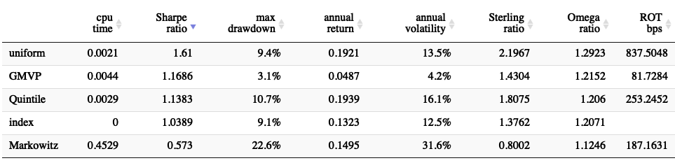
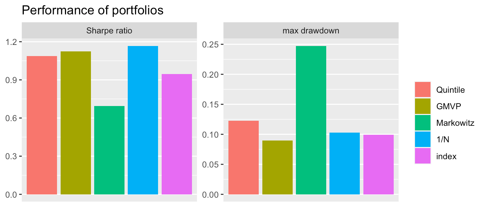
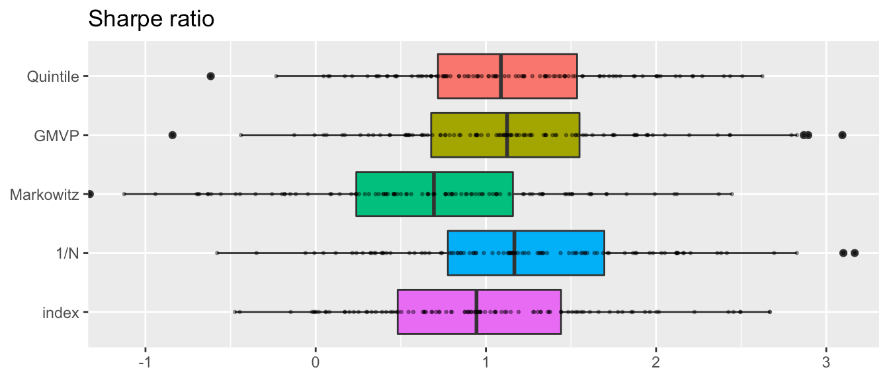

<!-- README.md is generated from README.Rmd. Please edit that file -->


# portfolioBacktest
[](https://CRAN.R-project.org/package=portfolioBacktest)
[](https://CRAN.R-project.org/package=portfolioBacktest)
[](https://CRAN.R-project.org/package=portfolioBacktest)

Automated backtesting of multiple portfolios over multiple 
datasets of stock prices in a rolling-window fashion. Intended for 
researchers and practitioners to backtest a set of different portfolios, 
as well as by a course instructor to assess the students in their portfolio 
design in a fully automated and convenient manner, with results conveniently 
formatted in tables and plots. Each portfolio design is easily defined as a
function that takes as input a window of the stock prices and outputs the 
portfolio weights. Multiple portfolios can be easily specified as a list 
of functions or as files in a folder. Multiple datasets can be conveniently 
extracted randomly from different markets, different time periods, and 
different subsets of the stock universe. The results can be later assessed 
and ranked with tables based on a number of performance criteria (e.g., 
expected return, volatility, Sharpe ratio, drawdown, turnover rate, return 
on investment, computational time, etc.), as well as plotted in a number of 
ways with nice barplots and boxplots.


## Installation
The package can be installed from [CRAN](https://CRAN.R-project.org/package=portfolioBacktest) or [GitHub](https://github.com/dppalomar/portfolioBacktest):

```r
# install stable version from CRAN
install.packages("portfolioBacktest")

# install development version from GitHub
devtools::install_github("dppalomar/portfolioBacktest")
```

To get help:

```r
library(portfolioBacktest)
help(package = "portfolioBacktest")
?portfolioBacktest
```

To cite `portfolioBacktest` in publications:

```r
citation("portfolioBacktest")
```


## Quick Start
Do the backtest on your own portfolio following few steps:

- **Step 1** - load package & dataset

```r
library(portfolioBacktest)
data("dataset10")
```
- **Step 2** - define your own portfolio

```r
my_portfolio <- function(dataset, w_current) {
  prices <- dataset$adjusted
  N <- ncol(prices)
  return(rep(1/N, N))
}
```
- **Step 3** - do backtest

```r
bt <- portfolioBacktest(my_portfolio, dataset10)
```
- **Step 4** - check your portfolio performance

```r
backtestSummary(bt)$performance
#>                           fun1
#> Sharpe ratio      1.541403e+00
#> max drawdown      8.937890e-02
#> annual return     1.641528e-01
#> annual volatility 1.218623e-01
#> Sterling ratio    2.213819e+00
#> Omega ratio       1.295090e+00
#> ROT (bps)         6.997663e+02
#> VaR (0.95)        1.101934e-02
#> CVaR (0.95)       1.789425e-02
#> cpu time          1.076923e-03
#> failure rate      0.000000e+00
```

For a more detailed explanation on how to use the package with all the features, check the [vignette](https://CRAN.R-project.org/package=portfolioBacktest/vignettes/PortfolioBacktest.html).


## Package Snapshot
This package backtests a list of portfolios over multiple datasets on a rolling-window basis, producing final results as in the following.

- Performance table:




- Barplot:




- Boxplot:



## Documentation
For more detailed information, please check the
[vignette](https://CRAN.R-project.org/package=portfolioBacktest/vignettes/PortfolioBacktest.html).


## Links
Package: [CRAN](https://CRAN.R-project.org/package=portfolioBacktest) and [GitHub](https://github.com/dppalomar/portfolioBacktest).

README file: [GitHub-readme](https://github.com/dppalomar/portfolioBacktest/blob/master/README.md).

Vignette: [CRAN-vignette](https://CRAN.R-project.org/package=portfolioBacktest/vignettes/PortfolioBacktest.html).
<!---
and [GitHub-vignette](https://htmlpreview.github.io/?https://github.com/dppalomar/portfolioBacktest/blob/master/vignettes/PortfolioBacktest.html).
--->


