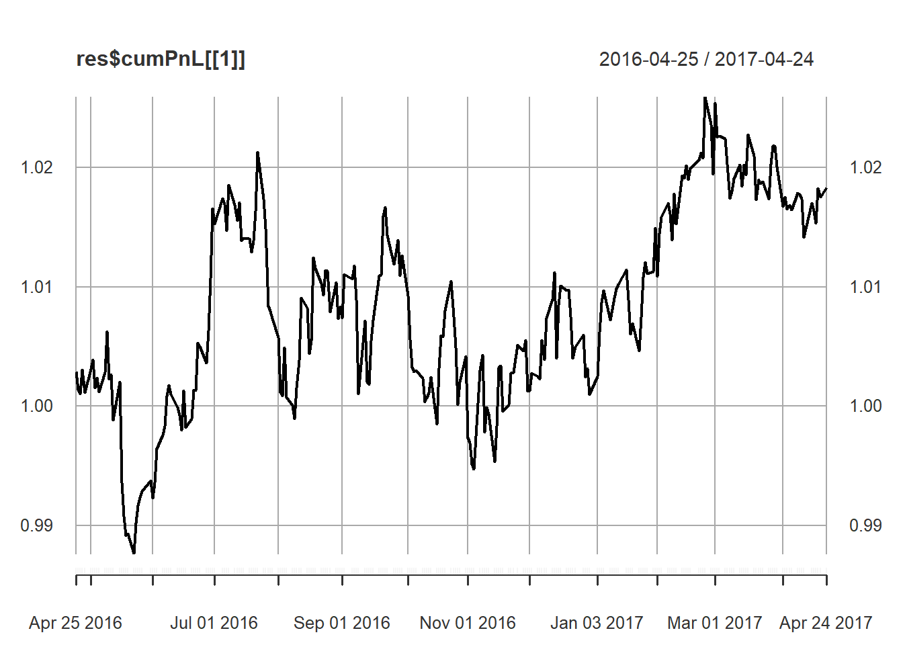

---
output:
  html_document:
    variant: markdown_github
    keep_md: true
  md_document:
    variant: markdown_github
---

<!-- README.md is generated from README.Rmd. Please edit that file -->


# portfolioBacktest
Backtesting of a portfolio in a rolling-window fashion over a dataset of stock prices. Multiple datasets are allowed (e.g., taken randomly over different markets, different time periods, and different subset of the stock universe). In addition, multiple portfolios can be backtested for a subsequent comparison and ranking on a number of criteria including expected return, volatility, Sharpe ratio, maximum drawdown, turnover rate, return on investment, computational time, etc. The portfolio is defined as a function that takes as input a window of the stock prices and outputs the portfolio weights. This package can be useful for a researcher/practitioner who wants to backtest a set of portfolios over a multitude of datasets over different markets. In addition, it can be particularly useful to evaluate students in a portfolio design course where the grading is based on the performance.


## Installation

```r
# install.packages("devtools")
devtools::install_github("dppalomar/portfolioBacktest")

# Getting help
library(portfolioBacktest)
help(package = "portfolioBacktest")
package?portfolioBacktest
?portfolioBacktest
```


## Usage of `portfolioBacktest()`
We start by loading the package and some random sets of stock market data:

```r
library(xts)
library(portfolioBacktest)
data(prices)
```
The dataset `prices` is a list of objects `xts` that contains the prices of random sets of stock market data from the S&P 500, HSI, NKY, SHZ, and UKC, over random periods of two years with a random selection of 50 stocks of each universe.
 

```r
length(prices)
#> [1] 50
str(prices[[1]])
#> An 'xts' object on 2008-11-27/2010-11-02 containing:
#>   Data: num [1:504, 1:50] 15.7 15.4 14.7 14.9 15.8 ...
#>  - attr(*, "dimnames")=List of 2
#>   ..$ : NULL
#>   ..$ : chr [1:50] "MSCI UN Equity" "MNST UW Equity" "LKQ UW Equity" "UDR UN Equity" ...
#>   Indexed by objects of class: [Date] TZ: UTC
#>   xts Attributes:  
#>  NULL

colnames(prices[[1]])
#>  [1] "MSCI UN Equity" "MNST UW Equity" "LKQ UW Equity"  "UDR UN Equity" 
#>  [5] "LB UN Equity"   "MS UN Equity"   "IFF UN Equity"  "TMO UN Equity" 
#>  [9] "BIIB UW Equity" "NOC UN Equity"  "CPB UN Equity"  "VMC UN Equity" 
#> [13] "ULTA UW Equity" "NVDA UW Equity" "FAST UW Equity" "WMB UN Equity" 
#> [17] "VRTX UW Equity" "EBAY UW Equity" "RHI UN Equity"  "XRAY UW Equity"
#> [21] "GRMN UW Equity" "ALGN UW Equity" "FTI UN Equity"  "NBL UN Equity" 
#> [25] "LLY UN Equity"  "FIS UN Equity"  "L UN Equity"    "STT UN Equity" 
#> [29] "CVX UN Equity"  "IR UN Equity"   "PKG UN Equity"  "CDNS UW Equity"
#> [33] "XLNX UW Equity" "JCI UN Equity"  "IBM UN Equity"  "VRSN UW Equity"
#> [37] "WFC UN Equity"  "SIVB UW Equity" "PM UN Equity"   "ZBH UN Equity" 
#> [41] "RTN UN Equity"  "CINF UW Equity" "ALXN UW Equity" "UTX UN Equity" 
#> [45] "AAPL UW Equity" "ADM UN Equity"  "BBY UN Equity"  "AMZN UW Equity"
#> [49] "MRO UN Equity"  "IPGP UW Equity"
```

Now, we define some portfolio design that takes as input the prices and outputs the portfolio vector `w`:

```r
portfolio_fun <- function(prices) {
  X <- diff(log(prices))[-1]  # compute log returns
  Sigma <- cov(X)  # compute SCM
  # design GMVP
  w <- solve(Sigma, rep(1, nrow(Sigma)))
  w <- w/sum(abs(w))  # normalized to have ||w||_1=1
  return(w)
}
```

We are then ready to use the function `backtestPortfolio()` that will execute and evaluate the portfolio design function on a rolling-window basis:

```r
res <- portfolioBacktest(portfolio_fun, prices[[1]], shortselling = TRUE)
names(res)
#> [1] "returns"       "cumPnL"        "performance"   "cpu_time"     
#> [5] "error"         "error_message"
plot(res$cumPnL)
```



```r
res$performance
#>    sharpe ratio    max drawdown expected return      volatility 
#>      1.48278986      0.02248487      0.06149754      0.04147421
```

We can also backtest over multiple data sets 

```r
# perform multiple backtesting
mul_res <- portfolioBacktest(portfolio_fun, prices[1:5], shortselling = TRUE)
mul_res$performance
#>                       [,1]       [,2]       [,3]       [,4]       [,5]
#> sharpe ratio    1.48278986 0.34314748 1.17388393 1.39310171 2.08764820
#> max drawdown    0.02248487 0.07102024 0.02481580 0.03196293 0.02448805
#> expected return 0.06149754 0.01306820 0.04379241 0.15265783 0.07007169
#> volatility      0.04147421 0.03808334 0.03730557 0.10958125 0.03356489
mul_res$performance_summary
#>    sharpe ratio (median)    max drawdown (median) expected return (median) 
#>               1.39310171               0.02481580               0.06149754 
#>      volatility (median) 
#>               0.03808334
```


## Links
Package: [GitHub](https://github.com/dppalomar/portfolioBacktest).  
README file: [GitHub-readme](https://rawgit.com/dppalomar/portfolioBacktest/master/README.html).  
Vignette: [GitHub-html-vignette](https://rawgit.com/dppalomar/portfolioBacktest/master/vignettes/PortfolioBacktest-vignette.html) and [GitHub-pdf-vignette](https://rawgit.com/dppalomar/portfolioBacktest/master/vignettes/PortfolioBacktest-vignette.pdf).

